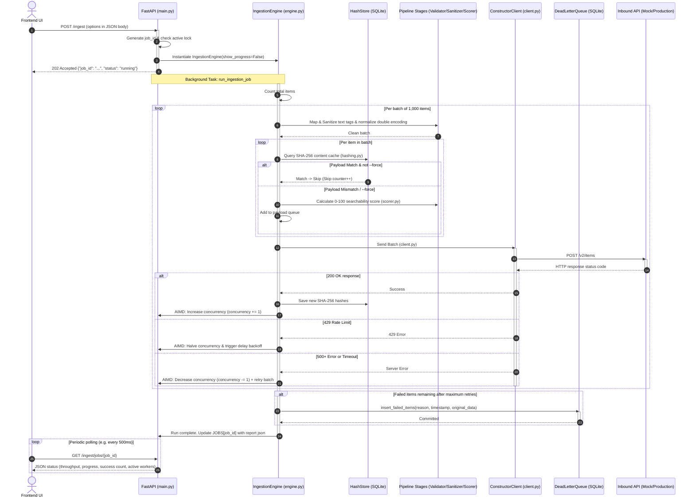

# ConstructSync — Frontend Developer API Reference & Architecture Flow

This document details the REST API specifications, payload schemas, and module execution flows for the ConstructSync pipeline middleware. It serves as a guide for frontend developers building dashboards or controls to trigger, monitor, and audit catalog sync operations.

---

## 1. REST API Index

The ConstructSync server runs by default on `http://127.0.0.1:8000`. All request and response bodies use JSON format, except for `/metrics` which returns Prometheus line exposition text.

| Method | Endpoint | Description | Authentication |
|:---|:---|:---|:---|
| **GET** | `/health` | Server health check status | None |
| **POST** | `/ingest` | Trigger background catalog sync run (CLI `ingest`) | None |
| **GET** | `/ingest/jobs` | Retrieve all past and running sync runs | None |
| **GET** | `/ingest/jobs/{job_id}` | Poll real-time progress and final report for a job | None |
| **GET** | `/dlq` | List and query dead-lettered SKU records (CLI `dlq-list`) | None |
| **GET** | `/dlq/{item_id}` | Inspect raw and sanitized payload for a specific DLQ item | None |
| **DELETE** | `/dlq/{item_id}` | Manually delete an item from the Dead-Letter Queue | None |
| **POST** | `/dlq/retry` | Reprocess failed DLQ items in the background (CLI `dlq-retry`) | None |
| **GET** | `/metrics` | Prometheus metrics for Grafana/Observability | None |

---

## 2. API Endpoint Schemas & Specifications

### 2.1 Trigger Ingestion
* **Endpoint:** `POST /ingest`
* **Content-Type:** `application/json`
* **Request Body Parameters:**

| Parameter | Type | Required | Default | CLI Equivalent | Description |
|:---|:---|:---|:---|:---|:---|
| `source` | `string` | No | `"file"` | `--source / -s` | Choice of: `"file"`, `"bestbuy"`, `"dummyjson"`, `"kafka"`. |
| `file_path` | `string` | Yes (if source is `file`) | `null` | `--file / -f` | Local absolute/relative path to CSV or JSONL. |
| `category` | `string` | No | `null` | `--category` | Category filter for Best Buy or DummyJSON API (e.g. `"laptops"`). |
| `limit` | `integer` | No | `5000` | `--limit` | Maximum records to fetch from live API source. |
| `target` | `string` | No | `"constructor-mock"` | `--target` | Endpoint destination. Set to `"constructor-mock"` to use local port 8001. |
| `force_sync` | `boolean` | No | `false` | `--force` | Set `true` to bypass the SHA-256 change detection cache. |
| `health_threshold` | `integer` | No | `70` | `--health_threshold` | Minimum searchability score (0–100) below which warning is logged. |
| `batch_size` | `integer` | No | `1000` | `--batch-size` | Batch size per upload chunk sent to Constructor. |
| `concurrency` | `integer` | No | `4` | `--concurrency` | Initial worker concurrency. AIMD scales this dynamically. |
| `base_url` | `string` | No | `null` | `--base-url` | Override Constructor API base URL. |
| `api_key` | `string` | No | `null` | `--api-key` | Override Constructor API key credential. |

* **Request Example:**
```json
{
  "source": "file",
  "file_path": "data/processed/demo_products_augmented.csv",
  "target": "constructor-mock",
  "force_sync": false,
  "health_threshold": 70,
  "batch_size": 1000,
  "concurrency": 4
}
```

* **Success Response (202 Accepted):**
```json
{
  "job_id": "job_1786820207_da52a9",
  "status": "running",
  "message": "Ingestion job started in background."
}
```

* **Error Responses:**
  - **400 Bad Request:** If `source == "file"` but `file_path` is omitted.
  - **409 Conflict:** If a sync job is already actively running (`{"detail": "An ingestion job is already running."}`).

---

### 2.2 List Ingestion Jobs
* **Endpoint:** `GET /ingest/jobs`
* **Response (200 OK):**
```json
[
  {
    "job_id": "job_1786820207_da52a9",
    "status": "completed",
    "source": "file",
    "total_items": 10006,
    "items_sent": 10006,
    "items_skipped": 0,
    "items_failed": 0,
    "batches_sent": 11,
    "batches_remaining": 0,
    "throughput": 4601.2,
    "concurrency": 15,
    "api_calls": 11,
    "retries": 0,
    "start_time": 1786820207.88,
    "end_time": 1786820210.05,
    "error": null,
    "report": {
      "timestamp": "2026-08-15T18:56:52",
      "run_summary": {
        "total_items": 10006,
        "items_sent": 10006,
        "items_skipped": 0,
        "items_failed": 0,
        "batches_total": 11,
        "batches_sent": 11,
        "batches_failed": 0,
        "time_elapsed_seconds": 2.17,
        "avg_throughput_items_sec": 4601.26,
        "api_calls": 11,
        "retries": 0,
        "peak_concurrency": 15
      },
      "sanitization_stats": {
        "items_sanitized": 248,
        "items_failed_validation": 0,
        "tags_stripped": 174,
        "entities_encoded": 107,
        "double_encoded_normalized": 0
      },
      "health_score_distribution": {
        "avg_score": 84.7,
        "min_score": 45,
        "max_score": 95,
        "items_below_threshold": 101,
        "threshold": 70,
        "score_histogram": {
          "0-10": 0, "11-20": 0, "21-30": 0, "31-40": 0, "41-50": 100,
          "51-60": 1, "61-70": 0, "71-80": 2, "81-90": 9798, "91-100": 105
        }
      },
      "status_codes": {
        "200": 11
      }
    }
  }
]
```

---

### 2.3 Get Specific Job Status
* **Endpoint:** `GET /ingest/jobs/{job_id}`
* **Response (200 OK):** Returns the exact JSON representation of the job as shown in Section 2.2. If `status` is `"running"`, the counter parameters (`items_sent`, `batches_sent`, `throughput`, `concurrency`) update in real-time (polled by the API every 0.5s from the engine thread), and the `report` field is `null`. Once `status` changes to `"completed"`, the full `report` sync metrics populate.
* **Error Response:**
  - **404 Not Found:** If the job ID is unknown.

---

### 2.4 Query Dead-Letter Queue (DLQ)
* **Endpoint:** `GET /dlq`
* **Query Parameters:**
  - `reason` (string, optional): Substring filter on failure message (e.g. `"429"`, `"CRITICAL"`).
  - `sku` (string, optional): Exact filter for item SKU/ID.
  - `limit` (integer, default: `100`): Pagination limit.
* **Response (200 OK):**
```json
[
  {
    "id": 12,
    "sku": "API-SKU-99",
    "reason": "Missing mandatory field: price",
    "timestamp": "2026-08-15T18:56:52.368Z",
    "retry_count": 3,
    "original_data": {
      "id": "API-SKU-99",
      "name": "Sparsely Listed Item",
      "description": "Plain details"
    },
    "sanitized_data": {
      "id": "API-SKU-99",
      "name": "Sparsely Listed Item",
      "description": "Plain details"
    }
  }
]
```

---

### 2.5 Inspect Specific DLQ Item
* **Endpoint:** `GET /dlq/{item_id}`
* **Response (200 OK):** Returns the single JSON item object matching the parameters in Section 2.4.
* **Error Response:**
  - **404 Not Found:** If the item ID does not exist in the DLQ table.

---

### 2.6 Delete DLQ Item
* **Endpoint:** `DELETE /dlq/{item_id}`
* **Response (200 OK):**
```json
{
  "status": "success",
  "message": "Deleted DLQ item 12"
}
```

---

### 2.7 Retry DLQ Processing
* **Endpoint:** `POST /dlq/retry`
* **Request Body Parameters:**

| Parameter | Type | Required | Default | Description |
|:---|:---|:---|:---|:---|
| `target` | `string` | No | `"constructor-mock"` | Destination target override (e.g. `"constructor-mock"` points to local mock server). |
| `base_url` | `string` | No | `null` | Constructor API base URL override. |
| `api_key` | `string` | No | `null` | Constructor API key credentials override. |

* **Response (202 Accepted):**
```json
{
  "job_id": "retry_1786820221_4740fa",
  "status": "running",
  "message": "DLQ retry started in background."
}
```
*(Progress of DLQ Retrying can be queried using the same `GET /ingest/jobs/{job_id}` status polling endpoint)*.

---

## 3. Architecture & Code Execution Flow

The flow diagram below outlines how the REST endpoints connect to the engine components and database storage:



---

## 4. Guidelines for Frontend Integration

1. **Active Job Locking:** 
   The frontend should disable the "Start Sync" buttons and show a spinner if the `/ingest/jobs` list returns any job with `"status": "running"`. If another `/ingest` request is attempted, the backend throws a `409 Conflict`.
2. **Progress Percentage Calculation:**
   Use the following formula in your progress bar UI:
   $$\text{Progress \%} = \min\left(100, \frac{\text{items\_sent} + \text{items\_skipped} + \text{items\_failed}}{\text{total\_items}} \times 100\right)$$
3. **Grafana / Metrics Integration:**
   Point your Prometheus agent to scrape `/metrics`. The gauges `constructsync_current_concurrency` and `constructsync_dlq_depth` should be mapped to single-stat panels to monitor the health of the middleware in real-time.
